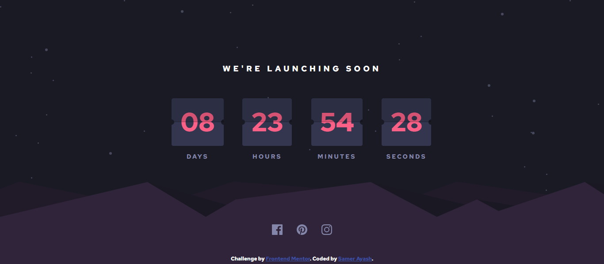

# Frontend Mentor - Launch countdown timer solution

This is a solution to the [Launch countdown timer challenge on Frontend Mentor](https://www.frontendmentor.io/challenges/launch-countdown-timer-N0XkGfyz-). Frontend Mentor challenges help you improve your coding skills by building realistic projects.

## Table of contents

- [Overview](#overview)
  - [The challenge](#the-challenge)
  - [Solution](#Solution)
- [My process](#my-process)
  - [Built with](#built-with)
- [Author](#author)

## Overview

### The challenge

Your challenge is to build out this launch countdown timer and get it looking as close to the design as possible. You can use any tools you like to help you complete the challenge. So if you've got something you'd like to practice, feel free to give it a go.
Your users should be able to:
- See hover and focus states for all interactive elements on the page

### Solution

- Solution URL: [launch-countdown-timer](https://github.com/SamerAyash/launch-countdown-timer)
- Live Site URL: [github.io/launch-countdown-timer](https://SamerAyash.github.io/launch-countdown-timer)

## My process

### Built with

- Semantic HTML5 markup
- CSS custom properties
- media query
- CSS Web Fonts
- JavaScript

## Author
:: Samer Ayash
- GitHub - [SamerAyash](https://github.com/SamerAyash)
- Frontend Mentor - [@SamerAyash](https://www.frontendmentor.io/profile/SamerAyash)
